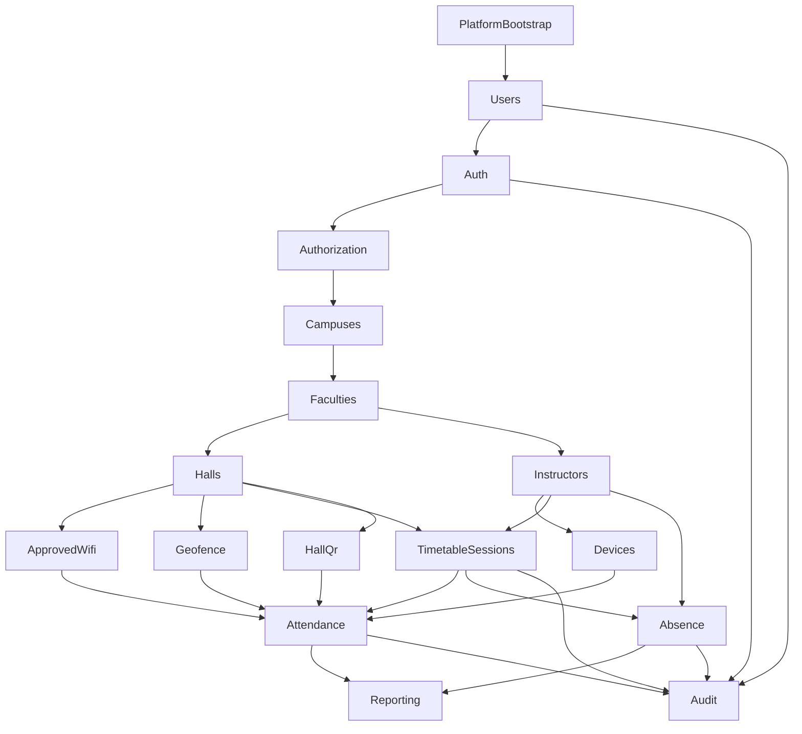

# Backend modules overview

This document describes all NestJS feature areas for the **JUST Instructor Attendance** backend ([JUST_instructor_attendance_requirements.md](./JUST_instructor_attendance_requirements.md)). It lists modules, their purpose, **implementation order**, and how they connect.

## Technology baseline

| Layer | Choice |
|--------|--------|
| API | NestJS, global prefix `api/v1` |
| Database | MongoDB |
| ODM | Mongoose (`@nestjs/mongoose`) |
| Auth | JWT after username + numeric passcode |
| Clients (later) | Flutter (mobile), React (dashboard) |

## Full module list

| # | Module doc | NestJS module name (suggested) | Purpose |
|---|------------|-------------------------------|---------|
| 1 | [module-platform-bootstrap.md](./module-platform-bootstrap.md) | `PlatformModule` / `AppModule` imports | Configuration, MongoDB, validation, errors, health |
| 2 | [module-users.md](./module-users.md) | `UsersModule` | User accounts, passcode storage, role assignment |
| 3 | [module-auth.md](./module-auth.md) | `AuthModule` | Login, JWT issuance, token validation strategy |
| 4 | [module-authorization.md](./module-authorization.md) | `AuthorizationModule` (guards/decorators) | Role checks, faculty data scoping |
| 5 | [module-campuses.md](./module-campuses.md) | `CampusesModule` | Multi-campus master data |
| 6 | [module-faculties.md](./module-faculties.md) | `FacultiesModule` | Faculties under campuses |
| 7 | [module-halls.md](./module-halls.md) | `HallsModule` | Classrooms/halls for QR and geofence linkage |
| 8 | [module-instructors.md](./module-instructors.md) | `InstructorsModule` | Instructor profile linked to `User` |
| 9 | [module-approved-wifi.md](./module-approved-wifi.md) | `ApprovedWifiModule` | Allowed SSIDs for attendance Wi-Fi check |
| 10 | [module-geofence.md](./module-geofence.md) | `GeofenceModule` | GPS boundary rules for attendance |
| 11 | [module-devices.md](./module-devices.md) | `DevicesModule` | Instructor device binding and verification |
| 12 | [module-timetable-sessions.md](./module-timetable-sessions.md) | `TimetableModule` | Sessions, Excel import, manual CRUD |
| 13 | [module-hall-qr.md](./module-hall-qr.md) | `HallQrModule` (or under `HallsModule`) | Signed/verifiable hall QR tokens |
| 14 | [module-attendance.md](./module-attendance.md) | `AttendanceModule` | Check-in/out, validation orchestration, duration and flags |
| 15 | [module-absence.md](./module-absence.md) | `AbsenceModule` | Absence requests and faculty decisions |
| 16 | [module-reporting.md](./module-reporting.md) | `ReportingModule` | Aggregations and report endpoints |
| 17 | [module-audit.md](./module-audit.md) | `AuditModule` | Append-only audit trail for accountability |

## Implementation order

Build in this order so each step has the dependencies it needs:

1. **Platform bootstrap** — Without config and DB, nothing else runs.
2. **Users** — Credentials and roles must exist before login.
3. **Auth** — JWT protects all other routes (NFR: authenticated APIs).
4. **Authorization** — Faculty-scoped vs super-admin behavior is required before writing domain APIs.
5. **Campuses → Faculties → Halls** — Geographic/organizational hierarchy for multi-campus and hall-linked validation.
6. **Instructors** — Links instructors to faculties for timetable and attendance ownership.
7. **Approved Wi‑Fi + Geofence** — Reference data consumed by attendance validation.
8. **Devices** — Device identity required before check-in (FR-14).
9. **Timetable & sessions** — Authoritative sessions drive check-in/out windows (FR-25–27).
10. **Hall QR** — Fallback verification path (FR-11, FR-28).
11. **Attendance** — Core check-in/out pipeline (depends on sessions, devices, Wi‑Fi, geofence, optional QR).
12. **Absence** — Session-linked workflow; interacts with attendance state (approved absence).
13. **Reporting** — Reads attendance, sessions, absences.
14. **Audit** — Implement the service early; wire emitters from auth, attendance, absence, timetable, and admin actions from the start.

## Dependency graph

## How modules work together

### Request flow (instructor check-in)

1. **Auth** validates JWT; **Authorization** ensures role is `INSTRUCTOR`.
2. **Attendance** loads **Timetable** `Session` and confirms it belongs to the instructor.
3. **Devices** confirms the request device is bound to that user.
4. **Approved Wi‑Fi** and **Geofence** validate payload (SSID, lat/lng) against rules scoped by campus/faculty/hall.
5. If method is QR, **Hall QR** validates token against **Hall** / session hall.
6. **Attendance** writes `AttendanceRecord` with **server timestamp**; **Audit** logs check-in.

### Request flow (faculty admin absence approval)

1. **Auth** + **Authorization** enforce `FACULTY_ADMIN` and **faculty scope** (same `facultyId` as request/session).
2. **Absence** updates request status; may update derived session/attendance classification.
3. **Audit** logs decision.

### Reporting

**Reporting** runs read-only aggregation pipelines over `sessions`, `attendance_records`, and `absence_requests`, respecting **Authorization** filters for faculty admins.

## Cross-cutting concerns

| Concern | Where it lives |
|---------|----------------|
| Global validation pipe | Platform bootstrap |
| JWT guard | Auth + global/registrar |
| Role + faculty scope | Authorization guards/decorators |
| Server time for attendance | Attendance service (`new Date()` on server only) |
| HTTPS | Infrastructure / reverse proxy (NFR) |

## Related documents

- Requirements: [JUST_instructor_attendance_requirements.md](./JUST_instructor_attendance_requirements.md)
- Per-module implementation specs: `module-*.md` in this folder
