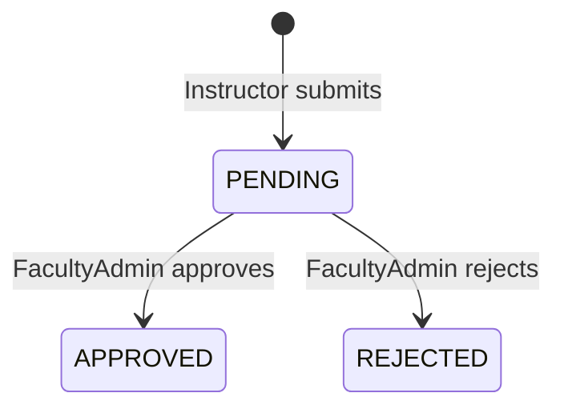

# Module: Absence

## Purpose

Let instructors **submit absence requests** linked to a **session** (FR-35–FR-40); **Faculty Admins** approve/reject (FR-38); outcomes update session/attendance classification (**approved absence** vs unapproved) (FR-39–FR-40). No categories or multi-level approval in v1 (FR-41, FR-42).

## Responsibilities

- Create absence request by instructor for a given `sessionId`.
- List pending/resolved requests for faculty admin (scoped).
- Approve / reject with optional comment.
- Prevent conflicting states: e.g. cannot approve if attendance already completed — define rules (see below).

## Database model(s) / schema

### Collection: `absence_requests`

| Field | Type | Index |
|-------|------|-------|
| `_id` | ObjectId | primary |
| `sessionId` | ObjectId | ref Session, indexed |
| `instructorUserId` | ObjectId | ref User |
| `facultyId` | ObjectId | denormalized |
| `status` | enum | `PENDING` \| `APPROVED` \| `REJECTED` |
| `submittedAt` | Date | server time |
| `decidedAt` | Date \| null | |
| `decidedBy` | ObjectId \| null | ref User (faculty admin / super admin) |
| `comment` | string \| null | optional instructor note |
| `decisionNote` | string \| null | optional admin note |
| `createdAt` / `updatedAt` | Date | |

**Unique constraint (optional):** One **open** request per session per instructor — enforce with partial unique index if Mongo version supports; else check in service: no second `PENDING` for same `sessionId` + `instructorUserId`.

**Mongoose (illustrative):**

```typescript
@Schema({ timestamps: true })
export class AbsenceRequest {
  @Prop({ type: Types.ObjectId, ref: 'Session', required: true, index: true })
  sessionId: Types.ObjectId;

  @Prop({ type: Types.ObjectId, ref: 'User', required: true, index: true })
  instructorUserId: Types.ObjectId;

  @Prop({ type: Types.ObjectId, ref: 'Faculty', required: true, index: true })
  facultyId: Types.ObjectId;

  @Prop({
    type: String,
    enum: ['PENDING', 'APPROVED', 'REJECTED'],
    default: 'PENDING',
  })
  status: 'PENDING' | 'APPROVED' | 'REJECTED';

  @Prop({ type: Date, required: true })
  submittedAt: Date;

  @Prop({ type: Date, default: null })
  decidedAt: Date | null;

  @Prop({ type: Types.ObjectId, ref: 'User', default: null })
  decidedBy: Types.ObjectId | null;

  @Prop()
  comment?: string;

  @Prop()
  decisionNote?: string;
}
```

### Derived reporting status

Either:

- Derive **approved absence** in reporting from `absence_requests.status === APPROVED`, or
- Denormalize `session.attendanceStatus` — optional; keep logic in one place preferably.

## Controller(s)

`AbsenceController` — `api/v1/absence`

## Service(s)

| Service | Methods |
|---------|---------|
| `AbsenceService` | `submit(dto, instructor)`, `listForInstructor`, `listPendingForFaculty(admin)`, `approve(id, admin)`, `reject(id, admin)` |
| `AbsencePolicy` (internal) | `canSubmitForSession(session, user)`, `isApprovedForSession(sessionId)` |

## Routes / endpoints

| Method | Path | Roles | Description |
|--------|------|-------|-------------|
| POST | `/absence/requests` | `INSTRUCTOR` | Submit |
| GET | `/absence/requests/me` | `INSTRUCTOR` | Own requests |
| GET | `/absence/requests` | `FACULTY_ADMIN`, `SUPER_ADMIN` | List; filters: status, date |
| GET | `/absence/requests/:id` | roles above + owner | Detail |
| POST | `/absence/requests/:id/approve` | `FACULTY_ADMIN`, `SUPER_ADMIN` | Approve |
| POST | `/absence/requests/:id/reject` | `FACULTY_ADMIN`, `SUPER_ADMIN` | Reject |

## Validation rules

### `SubmitAbsenceDto`

| Field | Rules |
|-------|--------|
| `sessionId` | `IsMongoId` |
| `comment` | `IsOptional`, `MaxLength(500)` |

### Approve/Reject

| Field | Rules |
|-------|--------|
| `decisionNote` | `IsOptional`, `MaxLength(500)` |

## Business logic

### Submit

1. Load session; ensure `session.instructorUserId === jwt.sub`.
2. Ensure session is **upcoming or same day** per policy — block absence for past completed sessions if inappropriate.
3. Reject if **duplicate pending** request.
4. Reject if **attendance already checked in** (unless product allows absence after mistake — recommend **block** once check-in exists).
5. `submittedAt = new Date()`; `status = PENDING`.
6. Audit `ABSENCE_SUBMIT`.

### Approve

1. Admin scoped: `request.facultyId === jwt.facultyId` or super admin.
2. If not `PENDING` → 409.
3. Set `APPROVED`, `decidedAt`, `decidedBy`.
4. Optional: create **synthetic attendance** record with status `APPROVED_ABSENCE` or rely on absence table only — pick one model:
   - **Model A (recommended):** No attendance row; reports join session + absence for status.
   - **Model B:** Insert attendance record with flags only — more duplication.
5. Audit `ABSENCE_APPROVE`.

### Reject

1. Same scoping; set `REJECTED`.
2. Audit `ABSENCE_REJECT`.

### Attendance interaction (FR-39–FR-40)

- **Approved:** Attendance module **rejects check-in** for that session (instructor marked absent officially).
- **Rejected:** Normal attendance rules apply; if no check-in, reporting shows **absent/unexcused** per your status enum ([SRS §15](./JUST_instructor_attendance_requirements.md)).

## Relationships with other modules

- **Sessions:** FK.
- **Users:** instructor and decider.
- **Attendance:** mutual exclusion rules.
- **Reporting:** approved vs rejected counts.
- **Audit.**

## Required permissions / access control

- Instructor: submit/list own.
- Faculty admin: decide only `facultyId` match.

## Important workflows



## Dependencies before implementing

- [module-timetable-sessions.md](./module-timetable-sessions.md)
- [module-auth.md](./module-auth.md), [module-authorization.md](./module-authorization.md)
- [module-audit.md](./module-audit.md)

## Implementation notes

- “Sent to Faculty Admin” (FR-37) is implemented as **scoped list query**, not messaging (notifications out of scope).
