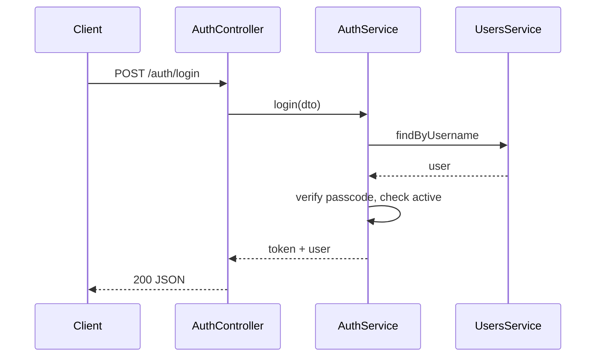

# Module: Auth

## Purpose

Authenticate users with **username + numeric passcode** (FR-01–FR-03) and issue **JWT** access tokens for subsequent API calls. All non-public endpoints require authentication (NFR §11.2).

## Responsibilities

- `POST /auth/login` — validate credentials, return JWT + minimal user profile.
- Register **Passport JWT strategy** (or custom guard) to validate `Authorization: Bearer <token>`.
- Provide **`JwtAuthGuard`** and **`@Public()`** decorator for routes that skip JWT (login, health).
- Optionally support **refresh tokens** (deferred unless needed); v1 can use short-lived access token only.
- Invoke **Audit** on successful login (and optionally failed attempts with care for PII/log noise).

## Database model(s) / schema

No separate collection required; uses **`User`** from [module-users.md](./module-users.md).

Optional future: `refresh_tokens` collection if implementing refresh rotation.

## Package dependencies

- `@nestjs/jwt`
- `@nestjs/passport`
- `passport`
- `passport-jwt`
- `bcrypt` or `argon2` (via UsersService)

## Controller(s)

`AuthController` — `api/v1/auth`

## Service(s)

| Service | Responsibility |
|---------|----------------|
| `AuthService` | `login(loginDto)`: load user by username, check `isActive`, verify passcode, build JWT payload, sign token |
| `JwtStrategy` | `validate(payload)` → attach `req.user` |

## Routes / endpoints

| Method | Path | Auth | Description |
|--------|------|------|-------------|
| POST | `/auth/login` | **Public** | Body: username, passcode → `{ accessToken, user: { id, role, facultyId, username } }` |

Optional:

| POST | `/auth/refresh` | Public or refresh cookie | If implemented later |

## Validation rules

### `LoginDto`

| Field | Rules |
|-------|--------|
| `username` | `IsString`, `IsNotEmpty` |
| `passcode` | `IsString`, `Matches(/^\d{6,9}$/)` |

## Business logic

1. Find user by username; if not found, use **generic error** (avoid user enumeration) or consistent 401.
2. If `!user.isActive` → 401.
3. Compare passcode to `passcodeHash`.
4. Sign JWT with claims:
   - `sub`: `user._id`
   - `role`: `user.role`
   - `facultyId`: `user.facultyId` (omit or null for super admin)

**Token TTL:** Config-driven (`JWT_EXPIRES_IN`, e.g. `15m` mobile-friendly vs dashboard — tune per client).

## JWT payload (example)

```json
{
  "sub": "507f1f77bcf86cd799439011",
  "role": "INSTRUCTOR",
  "facultyId": "507f1f77bcf86cd799439012",
  "iat": 1710000000,
  "exp": 1710000900
}
```

## Relationships with other modules

- **Users:** credential verification.
- **Authorization:** guards read `req.user` from JWT.
- **Audit:** login events.

## Required permissions / access control

- `/auth/login`: **public**.
- All other modules: default **JWT required** unless `@Public()`.

## Important workflows

### Login



## Dependencies before implementing

- [module-users.md](./module-users.md)
- [module-platform-bootstrap.md](./module-platform-bootstrap.md)

## Implementation notes

- Apply **`JwtAuthGuard` globally** in `AppModule`:

  ```typescript
  providers: [{ provide: APP_GUARD, useClass: JwtAuthGuard }]
  ```

- Use **HTTPS** in production (NFR); JWT in clear HTTP is unacceptable on untrusted networks.
- Consider **account lockout** or **rate limit** after N failures (product decision).
