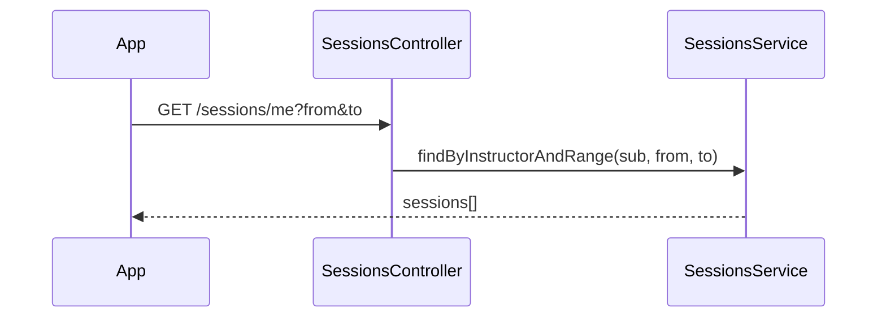

# Module: Timetable & sessions

## Purpose

Maintain the **authoritative schedule** of class sessions (FR-05–FR-08, FR-25–FR-27, FR-43–FR-46). Sessions drive timetable APIs for instructors and all attendance time-window validation.

## Responsibilities

- Create/read/update/delete **sessions** (manual).
- **Import** sessions from predefined **Excel** format (FR-43–FR-44): parse, validate rows, bulk insert, return per-row errors.
- Support instructor **timetable queries** by date range / week.
- Link each session to **instructor**, **faculty**, **campus**, **hall** (optional if hall TBD), scheduled start/end.

## Database model(s) / schema

### Collection: `sessions`

| Field | Type | Index |
|-------|------|-------|
| `_id` | ObjectId | primary |
| `facultyId` | ObjectId | required, indexed |
| `campusId` | ObjectId | required, indexed |
| `hallId` | ObjectId \| null | ref Hall |
| `instructorUserId` | ObjectId | ref User, **indexed** |
| `courseCode` | string | optional |
| `courseName` | string | |
| `sessionDate` | Date | date-only semantics in UTC or campus TZ — **document** |
| `scheduledStart` | Date | full instant |
| `scheduledEnd` | Date | full instant |
| `scheduledDurationMinutes` | number | denormalized for reporting |
| `source` | enum | `IMPORT` \| `MANUAL` |
| `importBatchId` | ObjectId \| null | groups Excel uploads |
| `status` | enum | `SCHEDULED` \| `CANCELLED` (optional extension) |
| `createdAt` / `updatedAt` | Date | |

**Indexes:**

- `{ instructorUserId: 1, sessionDate: 1, scheduledStart: 1 }` — timetable queries.
- `{ facultyId: 1, sessionDate: 1 }` — admin calendars.

**Mongoose (illustrative):**

```typescript
@Schema({ timestamps: true })
export class Session {
  @Prop({ type: Types.ObjectId, ref: 'Faculty', required: true, index: true })
  facultyId: Types.ObjectId;

  @Prop({ type: Types.ObjectId, ref: 'Campus', required: true, index: true })
  campusId: Types.ObjectId;

  @Prop({ type: Types.ObjectId, ref: 'Hall', default: null })
  hallId: Types.ObjectId | null;

  @Prop({ type: Types.ObjectId, ref: 'User', required: true, index: true })
  instructorUserId: Types.ObjectId;

  @Prop()
  courseCode?: string;

  @Prop({ required: true })
  courseName: string;

  @Prop({ required: true, index: true })
  sessionDate: Date;

  @Prop({ required: true })
  scheduledStart: Date;

  @Prop({ required: true })
  scheduledEnd: Date;

  @Prop({ required: true })
  scheduledDurationMinutes: number;

  @Prop({ type: String, enum: ['IMPORT', 'MANUAL'], required: true })
  source: 'IMPORT' | 'MANUAL';

  @Prop({ type: Types.ObjectId, default: null })
  importBatchId: Types.ObjectId | null;

  @Prop({ type: String, enum: ['SCHEDULED', 'CANCELLED'], default: 'SCHEDULED' })
  status: 'SCHEDULED' | 'CANCELLED';
}
```

### Collection: `timetable_import_batches` (optional)

| Field | Type | Notes |
|-------|------|-------|
| `uploadedBy` | ObjectId | user |
| `fileName` | string | |
| `rowCount` | number | |
| `errorCount` | number | |
| `createdAt` | Date | |

## Controller(s)

`TimetableController` or split `SessionsController` — `api/v1/sessions`

## Service(s)

| Service | Methods |
|---------|---------|
| `SessionsService` | `create`, `update`, `delete`, `findById`, `findByInstructorAndRange`, `findByFacultyAndRange` |
| `TimetableImportService` | `parseExcel(buffer)`, `validateRows`, `bulkInsert(rows, batchMeta)` |

Use **`xlsx`** or **`exceljs`** for parsing; stream large files if needed.

## Routes / endpoints

| Method | Path | Roles | Description |
|--------|------|-------|-------------|
| GET | `/sessions/me` | `INSTRUCTOR` | Query `from`, `to` dates → own sessions |
| GET | `/sessions/:id` | `INSTRUCTOR` (own), admins scoped | Session detail for selection (FR-08) |
| GET | `/sessions` | `SUPER_ADMIN`, `FACULTY_ADMIN` | Filter faculty, date range |
| POST | `/sessions` | `SUPER_ADMIN`, `FACULTY_ADMIN` | Manual create |
| PATCH | `/sessions/:id` | `SUPER_ADMIN`, `FACULTY_ADMIN` | Manual adjust (FR-46) |
| DELETE | `/sessions/:id` | `SUPER_ADMIN`, `FACULTY_ADMIN` | Delete/cancel |
| POST | `/sessions/import` | `SUPER_ADMIN`, `FACULTY_ADMIN` | Multipart Excel upload |

**Faculty admin:** all mutations scoped to `facultyId === jwt.facultyId`.

## Validation rules

### `CreateSessionDto`

| Field | Rules |
|-------|--------|
| `facultyId`, `campusId`, `instructorUserId` | `IsMongoId` |
| `hallId` | `IsOptional`, `IsMongoId` |
| `courseName` | `IsString` |
| `sessionDate` | `IsDateString` or `Type(() => Date)` |
| `scheduledStart`, `scheduledEnd` | ISO dates; **custom:** `scheduledEnd > scheduledStart` |
| `scheduledDurationMinutes` | optional if derived from start/end |

### Import DTO

- File: `FileInterceptor`; max size limit.
- Column mapping documented in README for admins.

## Business logic

- **Instructor timetable:** `instructorUserId = jwt.sub`, date range max span (e.g. 90 days) to protect DB.
- **Session belongs to instructor (FR-12):** attendance always loads session and compares `session.instructorUserId` to `jwt.sub`.
- **Time window (FR-13, FR-27):** defined in Attendance module; Session stores authoritative `scheduledStart` / `scheduledEnd`.
- **Excel import:** transactional strategy — either all-or-nothing or partial with error report; return `{ inserted, errors: [{ row, message }] }`.
- **Cancelled sessions:** attendance rejected if `status === CANCELLED`.

## Relationships with other modules

- **Users / Instructors:** `instructorUserId`.
- **Faculty, Campus, Hall:** FKs.
- **Attendance:** `sessionId`.
- **Absence:** `sessionId`.
- **Audit:** timetable upload, manual edits.

## Required permissions / access control

- **Instructor:** read only own sessions.
- **Faculty admin:** CRUD/import within faculty.
- **Super admin:** all.

## Important workflows

### Instructor week view



### Excel import

1. Admin uploads file → parse → validate → bulk write → create `importBatch` record.
2. Audit logs upload with batch id.

## Dependencies before implementing

- Organization + instructor modules (for validating FKs)
- [module-auth.md](./module-auth.md), [module-authorization.md](./module-authorization.md)

## Implementation notes

- Decide **single timezone strategy:** store instants in UTC; derive `sessionDate` consistently.
- Add **idempotency** for imports if files may be re-uploaded (e.g. natural key: instructor + start + course).
